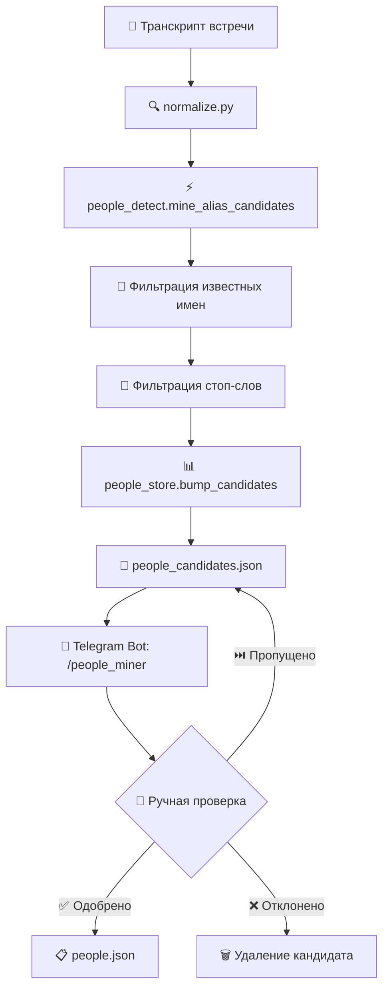

# Система управления людьми в Meet-Commit

## 🚀 Обзор

Система автоматически обнаруживает имена людей в транскриптах встреч и предоставляет удобный интерфейс через Telegram-бот для их верификации и добавления в основной словарь.

## 🏗️ Архитектура системы

### Компоненты

1. **Словари** (`app/dictionaries/`)
   - `people.json` - основной словарь людей с каноническими именами
   - `people_candidates.json` - кандидаты для проверки с частотой встречаемости
   - `people_stopwords.json` - стоп-слова для исключения ложных срабатываний
   - `active_users.json` - активные пользователи бота

2. **Детекция** (`app/core/people_detect.py`)
   - Автоматический поиск имен в транскриптах
   - Фильтрация известных имен и стоп-слов
   - Транслитерация русских имен в английские

3. **Хранилище** (`app/core/people_store.py`)
   - Загрузка и сохранение словарей
   - Управление кандидатами и их частотой
   - Thread-safe операции

4. **Telegram интерфейс** (`app/bot/handlers_people.py`)
   - Интерактивная верификация через бот
   - Статистика и управление
   - Административные команды

## 📊 Процесс работы



## 🤖 Использование через Telegram бот

### Основные команды

```
/people_miner    - Интерактивная проверка кандидатов
/people_stats    - Статистика системы людей
/people_reset    - Сброс состояния People Miner
```

### Интерактивная проверка

При выполнении `/people_miner` бот показывает:

```
🧩 People Miner - Верификация кандидатов

📝 Кандидат: Alice Johnson
🔢 Встречался: 5 раз(а)
💡 Предлагаемое имя: Alice Johnson

Выберите действие:
[✅ Добавить] [❌ Удалить] [⏭️ Пропустить] [📊 Статистика]
```

**Доступные действия:**
- **✅ Добавить** - принять кандидата с предложенным именем
- **❌ Удалить** - отклонить кандидата навсегда
- **⏭️ Пропустить** - пропустить сейчас, оставить в очереди
- **📊 Статистика** - показать общую статистику

### Ввод английского имени

Если выбрано "Добавить", бот предложит ввести каноническое английское имя:

```
✏️ Введите английское имя для кандидата "Алиса Петрова":

Предложение: Alisa Petrova

Отправьте имя или нажмите /cancel для отмены
```

## 📁 Структура данных

### people.json (новый формат)
```json
[
  {
    "name_en": "John Doe",
    "aliases": ["John", "Johnny", "Джон", "Джон Доу", "John Doe"]
  },
  {
    "name_en": "Alice Smith", 
    "aliases": ["Alice", "Алиса", "Alice Smith", "Алиса Смит"]
  }
]
```

### people_candidates.json
```json
{
  "candidates": {
    "Bob Johnson": 3,
    "Charlie Brown": 2,
    "Diana Prince": 1
  }
}
```

### people_stopwords.json
```json
{
  "stop": [
    "Проект", "Бюджет", "CEO", "Встреча", "Департамент",
    "Команда", "Руководитель", "Менеджер", "Директор"
  ]
}
```

## 🔍 Алгоритм детекции

### Паттерны поиска
- **Латинские имена**: `John`, `John Smith`, `Mary-Jane O'Connor`
- **Кириллические имена**: `Иван`, `Иван Петров`, `Анна-Мария`
- **Смешанные форматы**: `John Иванов`, `Анна Smith`

### Фильтрация
1. **Известные имена**: проверка по всем алиасам
2. **Стоп-слова**: исключение корпоративных терминов
3. **Формат**: длина 2-50 символов, корректные символы
4. **Исключения**: email, URL, номера, аббревиатуры

### Транслитерация
Автоматическое предложение английских имен:
- `Алиса Петрова` → `Alisa Petrova`
- `Борис Сидоров` → `Boris Sidorov`
- `Анна-Мария` → `Anna-Maria`

## 📊 Статистика и мониторинг

### Команда /people_stats
```
📊 Статистика People Management

👥 Основной словарь:
   • Людей: 25
   • Алиасов: 127
   • Средне алиасов/человек: 5.1

🔍 Кандидаты:
   • Всего: 12
   • Топ по частоте: Alice (5), Bob (3), Charlie (2)

📈 Активность:
   • Новых за сегодня: 3
   • Обработано за неделю: 15
```

### Метрики
- Количество людей в основном словаре
- Количество кандидатов в очереди
- Частота встречаемости кандидатов
- Статистика обработки

## 🛠️ Административные функции

### Для администраторов бота

```
/people_reset    - Сброс состояния People Miner
/admin_help      - Список всех административных команд
```

### CLI инструменты (для разработчиков)

```bash
# Статистика через CLI
python -m app.tools.people_miner --stats

# Очистка кандидатов
python -m app.tools.people_miner --clear

# Помощь
python -m app.tools.people_miner --help
```

## 🔧 API для разработчиков

### Основные функции

```python
from app.core.people_detect import mine_alias_candidates
from app.core.people_store import load_people, bump_candidates

# Поиск кандидатов в тексте
candidates = mine_alias_candidates("Встреча с Алисой и Bob Johnson")
# ["Алиса", "Bob Johnson"]

# Добавление кандидатов в очередь
bump_candidates(candidates)

# Загрузка основного словаря
people = load_people()
```

### Интеграция в обработку

```python
# В app/core/normalize.py
def normalize(payload):
    # ... основная обработка ...
    
    # Автоматический сбор кандидатов
    unknown_aliases = mine_alias_candidates(clean_text)
    if unknown_aliases:
        bump_candidates(unknown_aliases)
    
    return result
```

## 🧪 Тестирование

```bash
# Тесты детекции
pytest tests/test_people_detect.py -v

# Тесты хранилища
pytest tests/test_people_store.py -v

# Тесты Telegram handlers
pytest tests/test_handlers_people.py -v

# Интеграционные тесты
pytest tests/test_people_integration.py -v

# Все тесты системы людей
pytest tests/test_people* -v
```

## ⚙️ Настройка и конфигурация

### Добавление стоп-слов

Отредактируйте `app/dictionaries/people_stopwords.json`:

```json
{
  "stop": [
    "НовыйТермин",
    "Аббревиатура",
    "Должность"
  ]
}
```

### Настройка детекции

В `app/core/people_detect.py`:
- `max_scan` - лимит сканирования (по умолчанию 12000 символов)
- Паттерны регулярных выражений
- Правила валидации имен

## 🔧 Исправленные проблемы

### Проблема с полем Attendees в Notion

**✅ Исправлено в последней версии:**

**Проблема:** Поле Attendees в базе Meetings оставалось пустым

**Причины:**
1. `load_people()` не читала формат массива из `people.json`
2. `canonicalize_list()` игнорировала всех неизвестных людей
3. Отсутствие логирования процесса обработки участников

**Решение:**
1. **Исправлена `load_people()`** - теперь поддерживает формат массива `[{...}, {...}]`
2. **Улучшена `canonicalize_list()`**:
   - Известные люди → канонические имена из словаря
   - Неизвестные люди → исходные имена (сохраняются!)
   - Пустые строки → игнорируются
3. **Добавлено логирование** - видно процесс: `raw=[...] → canonical=[...]`

**Результат:** Поле Attendees заполняется смешанными именами

**Пример:**
```
raw=["Valya Dobrynin", "Nodari Kezua", "Sergey Lompa"]
canonical=["Valya Dobrynin", "Nodari Kezua", "Sergey Lompa"]
```

### Система пополнения people.json

**🔄 Автоматическое накопление:**
- При каждой обработке файла `mine_alias_candidates()` ищет новые имена
- Кандидаты накапливаются в `people_candidates.json` с частотами
- Из логов: `"Added 56 new candidates"`, `"Added 19 new candidates"`

**🛠️ Ручная верификация:**
- `/people_miner` - интерактивная обработка кандидатов
- Показывает кандидата с наибольшей частотой
- Админ решает: добавить, пропустить, удалить

**✅ Недавняя очистка (сентябрь 2025):**
- Обработано и добавлено: Ivan Zadokhin, Nodari Kezua
- Удалено проблемных кандидатов: 86 записей
- Улучшены стоп-слова: +38 слов (546 total)
- Качество фильтрации значительно повышено

## 🚀 Лучшие практики

### Регулярное использование
- Проверяйте кандидатов еженедельно через `/people_miner`
- Следите за статистикой через `/people_stats`
- Обновляйте стоп-слова при изменениях в компании

### Качество данных
- Используйте единообразные английские канонические имена
- Добавляйте все возможные варианты в алиасы
- Включайте русские и английские варианты написания

### Управление кандидатами
- Не пропускайте очевидно неправильные кандидаты - удаляйте их
- Используйте функцию "Пропустить" для сомнительных случаев
- Регулярно очищайте устаревших кандидатов

## 🔮 Планы развития

### Краткосрочные улучшения
- [ ] Поддержка склонений русских имен
- [ ] Групповые операции с кандидатами
- [ ] Экспорт/импорт словарей

### Долгосрочные планы
- [ ] ML для улучшения детекции
- [ ] Интеграция с корпоративными справочниками
- [ ] Веб-интерфейс для управления
- [ ] Поддержка других языков

## 🐛 Устранение неполадок

### Кандидаты не появляются
1. Проверьте стоп-слова в `people_stopwords.json`
2. Убедитесь, что имена не в основном словаре
3. Проверьте формат имен (длина, символы)

### Неправильная транслитерация
1. Используйте ручной ввод в боте
2. Обновите таблицу транслитерации в коде
3. Добавьте специальные случаи

### Бот не отвечает на команды
1. Проверьте права администратора
2. Убедитесь в корректности TELEGRAM_TOKEN
3. Проверьте логи бота

---

*Документация обновлена: сентябрь 2024*