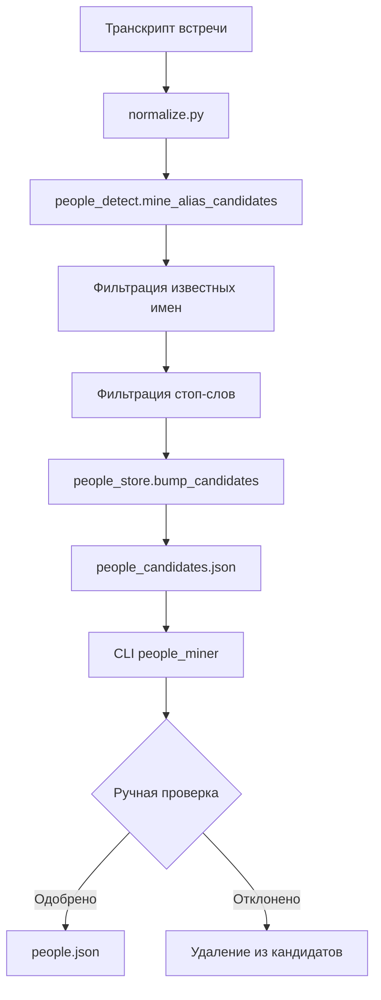

# Система управления словарем людей

Этот документ описывает новую систему управления словарем людей в проекте Meet-Commit, которая автоматически собирает кандидатов в новые имена из транскриптов встреч и позволяет вручную их проверять и добавлять в основной словарь.

## 🏗️ Архитектура

### Компоненты системы

1. **Словари** (`app/dictionaries/`)
   - `people.json` - основной словарь людей
   - `people_candidates.json` - очередь кандидатов для проверки
   - `people_stopwords.json` - стоп-слова для фильтрации

2. **Хранилище** (`app/core/people_store.py`)
   - Функции для работы с файлами словарей
   - Загрузка, сохранение, обновление данных

3. **Детектор** (`app/core/people_detect.py`)
   - Поиск имен в тексте
   - Транслитерация и нормализация
   - Валидация записей

4. **CLI инструмент** (`app/tools/people_miner.py`)
   - Интерактивная проверка кандидатов
   - Статистика и управление

## 📊 Процесс работы



## 🔧 Использование

### Автоматический сбор кандидатов

Сбор происходит автоматически при обработке транскриптов в `normalize.py`:

```python
from app.core.people_detect import mine_alias_candidates
from app.core.people_store import bump_candidates

# В процессе нормализации
unknown_aliases = mine_alias_candidates(clean_text)
if unknown_aliases:
    bump_candidates(unknown_aliases)
```

### Ручная проверка кандидатов

```bash
# Показать статистику
python -m app.tools.people_miner --stats

# Проверить топ-20 кандидатов
python -m app.tools.people_miner --top 20

# Проверить топ-10 кандидатов
python -m app.tools.people_miner --top 10

# Очистить словарь кандидатов
python -m app.tools.people_miner --clear
```

### Интерактивный процесс проверки

При запуске `python -m app.tools.people_miner` вы увидите:

```
🔍 Проверяем топ-20 кандидатов:
==================================================

📝 Кандидат #1: Alice
   Встречался: 5 раз(а)
   Предлагаемое имя: Alice

Варианты действий:
  [Enter] - принять предложение
  [custom] - ввести свой вариант
  s - пропустить этого кандидата
  q - завершить работу

Ваш выбор: 
```

## 📁 Структура файлов

### people.json
```json
{
  "people": [
    {
      "name_en": "John Doe",
      "aliases": ["John", "Johnny", "Джон", "John Doe"]
    },
    {
      "name_en": "Jane Smith", 
      "aliases": ["Jane", "Джейн", "Jane Smith"]
    }
  ]
}
```

### people_candidates.json
```json
{
  "candidates": {
    "Alice": 5,
    "Bob Johnson": 2,
    "Charlie": 1
  }
}
```

### people_stopwords.json
```json
{
  "stop": [
    "Проект", "Бюджет", "CEO", "Встреча",
    "Департамент", "Команда", "Руководитель"
  ]
}
```

## 🔍 Алгоритмы детекции

### Паттерны поиска имен

1. **Латинские имена**: `John`, `John Smith`, `Mary-Jane`
2. **Кириллические имена**: `Иван`, `Иван Петров`, `Анна-Мария`
3. **Составные имена**: поддержка дефисов и апострофов

### Фильтрация

1. **Известные имена**: проверка по всем алиасам и каноническим именам
2. **Стоп-слова**: исключение корпоративных терминов и должностей
3. **Валидация формата**: длина, символы, структура

### Транслитерация

Автоматическая транслитерация русских имен в английские:
- `Алиса` → `Alisa`
- `Борис Петров` → `Boris Petrov`
- `Анна-Мария` → `Anna-Maria`

## 🧪 Тестирование

Система покрыта комплексными тестами:

```bash
# Тесты хранилища
python -m pytest tests/test_people_store.py -v

# Тесты детектора
python -m pytest tests/test_people_detect.py -v

# Тесты CLI
python -m pytest tests/test_people_miner.py -v

# Интеграционные тесты
python -m pytest tests/test_people_integration.py -v

# Все тесты системы людей
python -m pytest tests/test_people* -v
```

## ⚙️ Настройка и конфигурация

### Добавление стоп-слов

Отредактируйте `app/dictionaries/people_stopwords.json`:

```json
{
  "stop": [
    "НовоеСтопСлово",
    "АббревиатураXYZ"
  ]
}
```

### Настройка детекции

В `app/core/people_detect.py` можно настроить:

- `max_scan` - лимит сканируемого текста (по умолчанию 12000 символов)
- Паттерны регулярных выражений для поиска имен
- Правила валидации имен

### Настройка транслитерации

Таблица транслитерации в функции `_translit_ru_en()` может быть расширена для специфических случаев.

## 🚀 Лучшие практики

### Регулярная проверка кандидатов

Рекомендуется проверять кандидатов еженедельно:

```bash
# Еженедельная процедура
python -m app.tools.people_miner --stats
python -m app.tools.people_miner --top 10
```

### Управление стоп-словами

- Добавляйте новые корпоративные термины в стоп-слова
- Включайте аббревиатуры и должности
- Обновляйте список при изменении структуры компании

### Качество данных

- Используйте единообразные канонические имена (английские)
- Добавляйте все возможные варианты в алиасы
- Включайте как русские, так и английские варианты

## 🔧 API Reference

### people_store.py

```python
# Основные функции
load_people() -> list[dict]
save_people(items: list[dict]) -> None
load_candidates() -> dict[str, int]
bump_candidates(aliases: Iterable[str]) -> None
load_stopwords() -> set[str]

# Утилиты
clear_candidates() -> None
remove_candidate(alias: str) -> bool
get_candidate_stats() -> dict[str, int]
```

### people_detect.py

```python
# Основные функции
mine_alias_candidates(text: str, max_scan: int = 12000) -> list[str]
propose_name_en(alias: str) -> str
validate_person_entry(person_data: dict) -> list[str]

# Статистика
get_detection_stats(text: str, max_scan: int = 12000) -> dict
```

## 🐛 Устранение неполадок

### Кандидаты не появляются

1. Проверьте, что имена не в стоп-словах
2. Убедитесь, что имена не уже известны
3. Проверьте формат имен (длина, символы)

### Неправильная транслитерация

1. Проверьте таблицу транслитерации в `_translit_ru_en()`
2. Добавьте специальные случаи если нужно
3. Используйте ручной ввод в CLI для исправления

### Проблемы с производительностью

1. Уменьшите `max_scan` для больших текстов
2. Оптимизируйте стоп-слова для вашего домена
3. Регулярно очищайте кандидатов

## 📈 Мониторинг и метрики

### Ключевые метрики

- Количество новых кандидатов в день/неделю
- Процент одобренных кандидатов
- Время обработки транскриптов
- Точность детекции известных имен

### Логирование

Система использует стандартное логирование Python:

```python
import logging
logger = logging.getLogger(__name__)

# В коде
logger.info("Added 5 new candidates")
logger.debug("Found 10 name candidates in text")
```

## 🔮 Планы развития

### Краткосрочные улучшения

- [ ] Поддержка склонений русских имен
- [ ] Автоматическое определение пола по имени
- [ ] Интеграция с корпоративным справочником

### Долгосрочные планы

- [ ] Machine Learning для улучшения детекции
- [ ] Поддержка других языков
- [ ] Веб-интерфейс для управления словарем
- [ ] API для внешних систем

---

*Документация обновлена: декабрь 2024*
