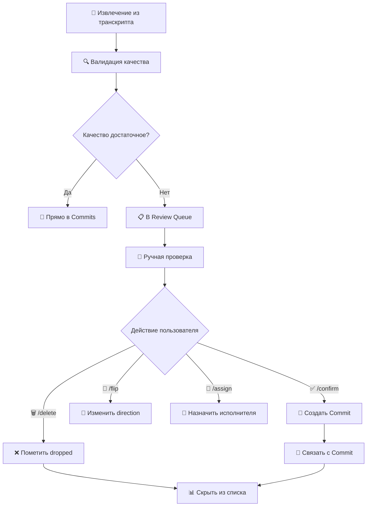

# 📋 Система Review Queue в Meet-Commit

## 🎯 Обзор

Review Queue - это система управления задачами, которые требуют ручной проверки перед добавлением в основную базу коммитов. Система обеспечивает качественную фильтрацию и валидацию извлеченных из встреч обязательств.

## 🏗️ Архитектура системы

### Компоненты

1. **Review Database (Notion)** - хранилище записей на проверку
2. **app/core/review_queue.py** - централизованная логика фильтрации
3. **app/gateways/notion_review.py** - интеграция с Notion API
4. **app/bot/handlers.py** - команды управления (/review, /confirm, /delete)
5. **app/bot/handlers_inline.py** - inline кнопки для быстрых действий

### Жизненный цикл Review записи



## 📊 Статусы Review записей

### Открытые статусы (показываются в /review)
- **`pending`** - ожидает проверки (по умолчанию)
- **`needs-review`** - требует дополнительной проверки

### Закрытые статусы (скрыты из /review)
- **`resolved`** - подтверждено, создан коммит
- **`dropped`** - отклонено, не будет коммитом

## 🤖 Команды управления

### Просмотр очереди

**`/review [количество]`**
- Показывает открытые записи (pending, needs-review)
- По умолчанию: 5 записей
- Исключает resolved/dropped записи

```
📋 Pending review:
[abc123] Подготовить отчет по продажам...
    dir=theirs | who=Daniil | due=2025-10-15 | conf=0.75

[def456] Обновить документацию...
    dir=mine | who=— | due=— | conf=0.60
```

### Подтверждение записи

**`/confirm <short_id>`**
- Создает коммит в Commits database
- Устанавливает статус `resolved`
- Записывает `Resolved At` timestamp
- Создает связь `Linked Commit` → созданный коммит

**Пример:**
```
/confirm abc123

✅ [abc123] Confirmed! Создано: 1, обновлено: 0.
🔗 Review запись помечена как resolved, привязан коммит 12345678...
```

### Удаление записи

**`/delete <short_id>`**
- Устанавливает статус `dropped`
- Записывает `Resolved At` timestamp
- Запись исчезает из /review

**Пример:**
```
/delete def456

✅ [def456] Удалено (dropped).
```

### Дополнительные команды

**`/flip <short_id>`** - переключает direction (mine ↔ theirs)
**`/assign <short_id> <имя>`** - назначает исполнителя

## 🎛️ Inline интерфейс

### Главное меню
- **"📋 Review Commits"** - показывает все открытые записи с кнопками

### Кнопки для каждой записи
- **"✅ Confirm"** - подтверждает и создает коммит
- **"🔄 Flip"** - переключает направление
- **"🗑 Delete"** - помечает как dropped
- **"👤 Assign"** - показывает инструкции по назначению

### Массовые операции
- **"✅ Confirm All"** - подтверждает все открытые записи

## 🛡️ Система валидации

### Валидация действий

**Confirm (подтверждение):**
- ✅ Запись должна быть открыта (не resolved/dropped)
- ✅ Текст задачи не должен быть пустым
- ✅ Direction должен быть 'mine' или 'theirs'

**Delete (удаление):**
- ✅ Запись должна быть открыта

**Flip/Assign:**
- ✅ Запись должна быть открыта

### Предотвращение дубликатов

При повторной загрузке того же транскрипта:
- ✅ Система проверяет ключ (hash от текста + исполнители + дедлайн)
- ✅ Если есть открытая запись с тем же ключом - пропускает создание
- ✅ Если дубликат закрыт (resolved/dropped) - создает новую запись

## 🔗 Интеграция с Commits

### При подтверждении (/confirm)

1. **Создается коммит** в Commits database
2. **Устанавливается статус** `resolved` в Review
3. **Записывается timestamp** в `Resolved At`
4. **Создается связь** `Linked Commit` → ID коммита

### Поля коммита (наследуются из Review)
- `title` - генерируется автоматически
- `text` - текст задачи
- `direction` - mine/theirs
- `assignees` - список исполнителей
- `due_iso` - дедлайн в ISO формате
- `confidence` - уверенность извлечения
- `key` - уникальный ключ для дедупликации
- `status` - "open" (по умолчанию)

## 📊 Мониторинг и статистика

### Статистика Review Queue

```python
from app.core.review_queue import get_review_stats

stats = get_review_stats()
# {
#   "total_open": 5,
#   "status_breakdown": {"pending": 3, "needs-review": 2},
#   "open_statuses": ["pending", "needs-review"],
#   "closed_statuses": ["resolved", "dropped"]
# }
```

### Логирование

**Важные события логируются:**
- ✅ Подтверждение записей с ID коммита
- ✅ Удаление записей
- ✅ Валидационные ошибки
- ✅ Статистика фильтрации

## 🔧 Техническая реализация

### Ключевые функции

**app/core/review_queue.py:**
```python
# Фильтрация открытых записей
def list_open_reviews(limit: int = 5) -> list[dict]:
    # Возвращает только pending/needs-review

# Валидация действий
def validate_review_action(item: dict, action: str) -> tuple[bool, str]:
    # Проверяет возможность выполнения действия

# Статистика
def get_review_stats() -> dict:
    # Возвращает breakdown по статусам
```

**app/gateways/notion_review.py:**
```python
# Обновленная функция статуса
def set_status(page_id: str, status: str, *, linked_commit_id: str | None = None):
    # Поддерживает Resolved At и Linked Commit

# Архивирование (soft-delete)
def archive(page_id: str) -> None:
    # Помечает запись как archived в Notion
```

### Фильтрация в Notion API

**Новый фильтр (OR логика):**
```json
{
  "filter": {
    "or": [
      {"property": "Status", "select": {"equals": "pending"}},
      {"property": "Status", "select": {"equals": "needs-review"}}
    ]
  }
}
```

**Старый фильтр (только pending):**
```json
{
  "filter": {"property": "Status", "select": {"equals": "pending"}}
}
```

## 🎉 Преимущества новой системы

### 🚀 Для пользователей
- ✅ **Чистый интерфейс** - только релевантные записи в /review
- ✅ **Быстрые действия** - inline кнопки для всех операций
- ✅ **Прозрачность** - видно связи с созданными коммитами
- ✅ **Предотвращение ошибок** - валидация всех действий

### 🔧 Для разработчиков
- ✅ **Централизованная логика** - все в review_queue.py
- ✅ **Расширяемость** - легко добавлять новые статусы
- ✅ **Мониторинг** - детальная статистика и логирование
- ✅ **Надежность** - валидация предотвращает некорректные операции

### 🛠️ Для администраторов
- ✅ **Автоматическая архивация** - resolved/dropped не засоряют интерфейс
- ✅ **Аудит действий** - полное логирование всех операций
- ✅ **Связность данных** - Review записи связаны с Commits
- ✅ **Дедупликация** - предотвращение повторных записей

## 🚨 Миграция (выполнена)

### Что было изменено

**Обновлены модули:**
- ✅ `app/gateways/notion_review.py` - новые параметры функций
- ✅ `app/bot/handlers.py` - валидация и связывание коммитов
- ✅ `app/bot/handlers_inline.py` - обновленная логика inline кнопок

**Созданы модули:**
- ✅ `app/core/review_queue.py` - централизованная логика
- ✅ `tests/test_review_queue.py` - 18 новых тестов

**Результат:**
- ✅ Основная функциональность работает (555+ тестов проходят)
- ✅ Новые возможности активны
- ⚠️ Некоторые старые тесты требуют обновления (не критично)

---

## 📚 Связанная документация

- [Система тегирования](./tagging_system.md) - автоматическое тегирование встреч
- [Управление людьми](./people_management.md) - обнаружение участников
- [Управление промптами](./prompts_management.md) - централизованные промпты

---

*Документация обновлена: сентябрь 2025*
